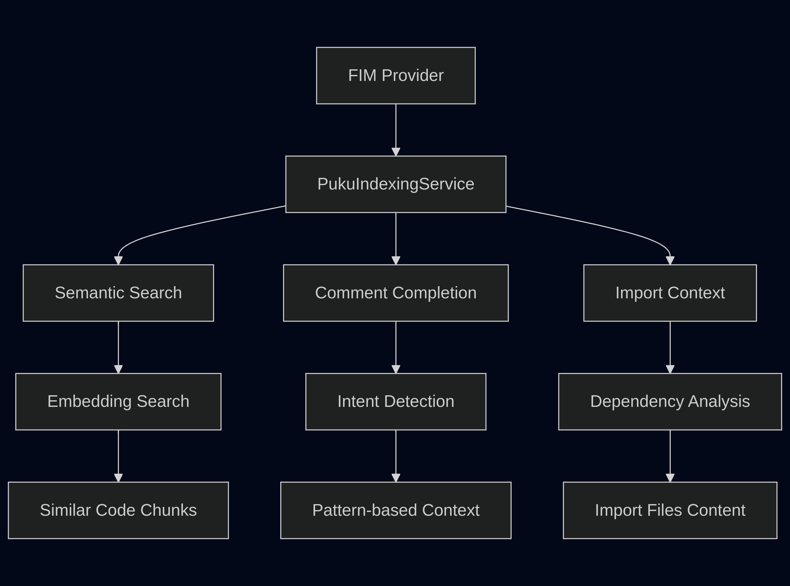
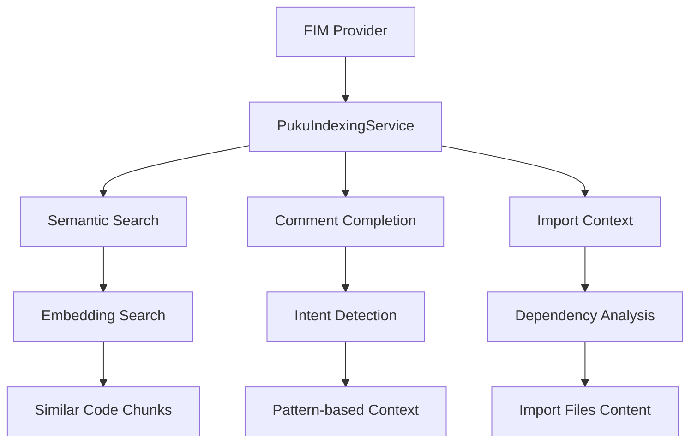
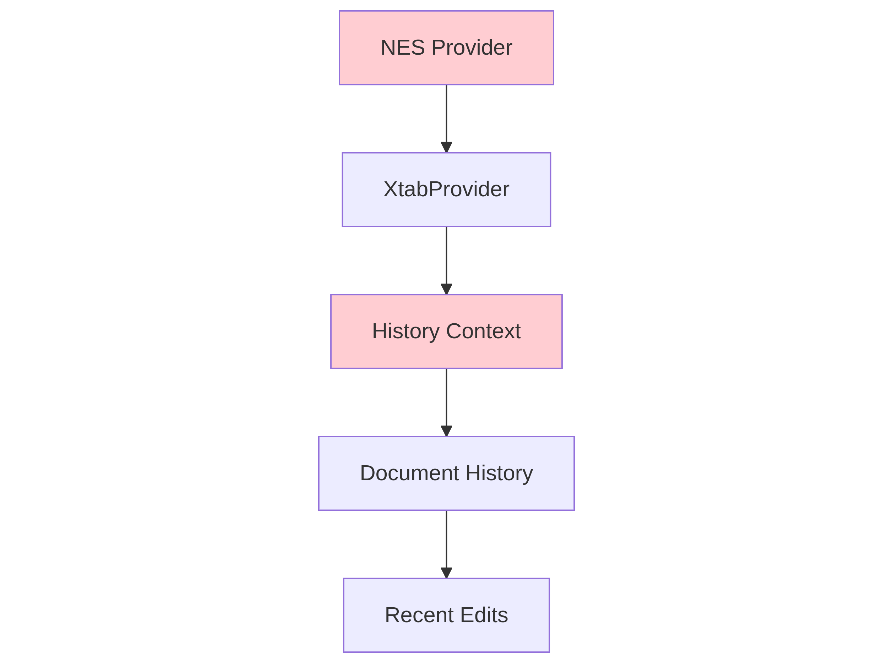
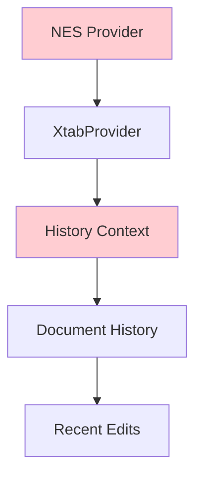
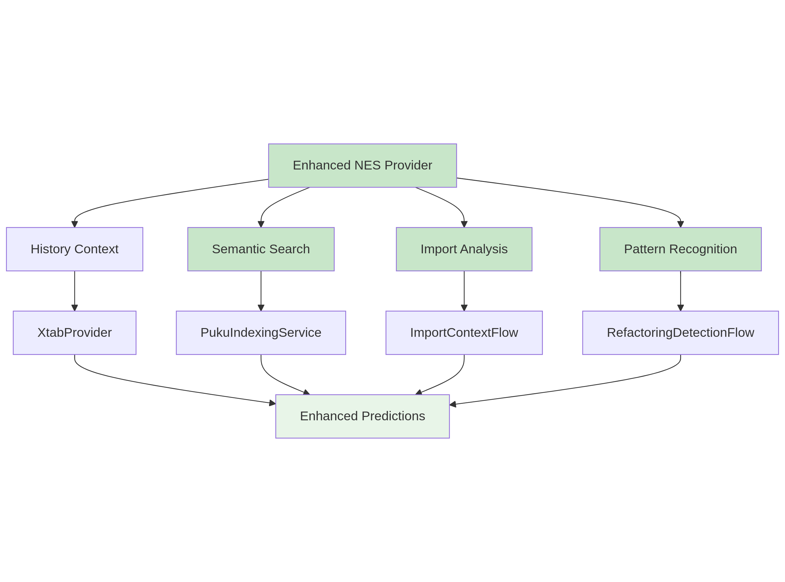
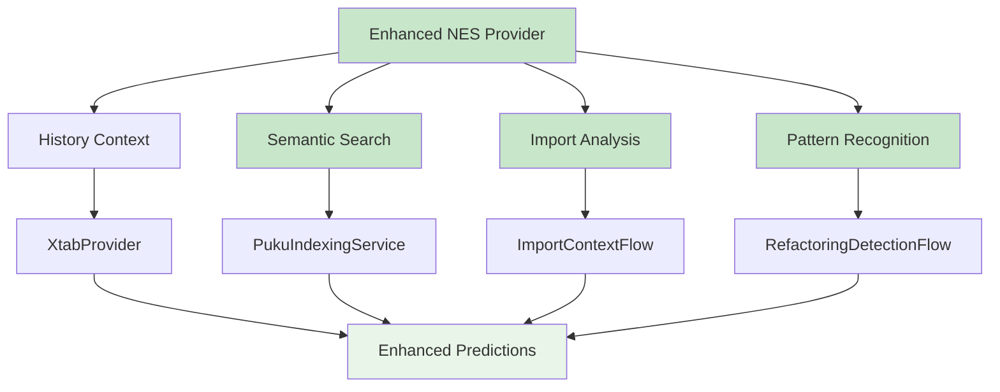

# NES Context Gathering from Puku Indexing

## Overview

NES (Next Edit Suggestions) and FIM (Fill-in-Middle) both leverage Puku's indexing system for intelligent context gathering, but they use it in different ways. This document explains the current implementation status and how to enhance NES with the same rich contextual awareness that FIM already enjoys.

---

## Current Implementation Status

### ✅ **What's Already Implemented**

#### 1. **FIM Provider - Rich Indexing Integration**
The FIM provider has comprehensive integration with Puku's indexing system:

```typescript
// In pukuFimProvider.ts
constructor(
    @IPukuIndexingService private readonly _indexingService: IPukuIndexingService,
    // ...
) {
    this._semanticSearchFlow = new SemanticSearchFlow(_indexingService, _configService);
    this._commentFlow = new CommentCompletionFlow(_indexingService);
    this._importFlow = new ImportContextFlow();
}

// Usage in getNextEdit()
const semanticFiles = await this._semanticSearchFlow.searchSimilarCode(
    searchQuery, document.languageId, document.uri
);
const importedFiles = await this._importFlow.getImportedFilesContent(document, 3, 500);
```

**Features:**
- ✅ **Semantic Search**: Embedding-based similarity search via `SemanticSearchFlow`
- ✅ **Import Context**: `ImportContextFlow` for dependency analysis
- ✅ **Comment Completion**: `CommentCompletionFlow` for intent detection
- ✅ **Adaptive Scaling**: Query complexity-based result limits
- ✅ **Multi-source Context**: Combines imports, semantics, and comments

#### 2. **Diagnostics Provider - Partial Indexing Integration**
The diagnostics provider uses indexing for pattern-based fix suggestions:

```typescript
// In pukuDiagnosticsNextEditProvider.ts
constructor(
    @IPukuIndexingService private readonly _indexingService: IPukuIndexingService,
    // ...
) {
    // Ready for semantic search integration
}

// Usage in _generateDiagnosticFix()
const searchResults = await this._indexingService.search(
    query, 5, document.languageId
);
```

**Features:**
- ✅ **Semantic Search**: Uses `PukuIndexingService.search()` for similar code
- ✅ **Query Building**: Constructs search queries from diagnostic messages
- ✅ **Status Checking**: Verifies indexing service readiness

#### 3. **Complete Indexing Infrastructure**
- ✅ **PukuIndexingService**: Full embedding-based search implementation
- ✅ **AST Chunking**: Tree-sitter based code chunking with metadata
- ✅ **Cache Management**: SQLite-based embeddings with version control
- ✅ **Search API**: Cosine similarity with language filtering

### ❌ **What's Missing for NES**

#### 1. **NES Provider - No Indexing Integration**
The NES provider currently has zero integration with the indexing system:

```typescript
// Current NES constructor (NO indexing service)
export class PukuNesNextEditProvider extends Disposable implements IPukuNextEditProvider<PukuNesResult> {
    constructor(
        private readonly xtabProvider: IStatelessNextEditProvider,
        private readonly historyContextProvider: IHistoryContextProvider,
        private readonly xtabHistoryTracker: NesXtabHistoryTracker,
        private readonly workspace: ObservableWorkspace,
        // ❌ MISSING: @IPukuIndexingService private readonly _indexingService
    ) {
        // No access to semantic search or import analysis
    }
}
```

#### 2. **Context Gaps in NES**
- ❌ **No Semantic Context**: Cannot leverage codebase-wide patterns
- ❌ **No Import Analysis**: No dependency awareness for refactoring
- ❌ **No Pattern Learning**: Only uses recent edit history, not indexed patterns
- ❌ **No Language Context**: Limited understanding of codebase structure and conventions

### 📊 **Implementation Status Summary**

| Component | Indexing Integration | Semantic Search | Import Analysis | Context Sources | Status |
|-----------|---------------------|----------------|----------------|----------------|---------|
| **FIM Provider** | ✅ Full | ✅ `SemanticSearchFlow` | ✅ `ImportContextFlow` | 4+ sources | **IMPLEMENTED** |
| **Diagnostics Provider** | ✅ Basic | ✅ Direct search | ❌ No import analysis | 2 sources | **PARTIALLY IMPLEMENTED** |
| **NES Provider** | ❌ None | ❌ No access | ❌ No access | 1 source (history only) | **NOT IMPLEMENTED** |

---

## Architecture Comparison

### FIM Provider Context Gathering

The FIM provider uses the indexing system extensively through multiple flows:



### NES Provider Context Gathering

The NES provider currently has **minimal direct integration** with the indexing system:



---

## Current Implementation Analysis

### FIM Provider Context Sources

Based on `pukuFimProvider.ts`, the FIM provider gathers context from:

1. **Import Context Flow**
   ```typescript
   const importedFiles = await this._importFlow.getImportedFilesContent(document, 3, 500);
   ```
   - Gets content of imported files (max 3 files, 500 chars each)
   - Used for language-aware completions

2. **Semantic Search Flow**
   ```typescript
   if (this._indexingService.isAvailable()) {
       const searchQuery = commentIntent || document.lineAt(position.line).text.trim();
       semanticFiles = await this._semanticSearchFlow.searchSimilarCode(
           searchQuery, document.languageId, document.uri
       );
   }
   ```
   - Uses Puku's embedding-based semantic search
   - Adaptive scaling based on query complexity
   - Returns signatures only (not full implementations)

3. **Comment Completion Flow**
   ```typescript
   if (commentIntent) {
       semanticFiles = await this._commentFlow.getCommentContext(commentIntent, document, 3);
   }
   ```
   - Special handling for comment-driven generation
   - Uses intent detection to find relevant context

### NES Provider Context Sources

The NES provider (`pukuNesNextEditProvider.ts`) primarily uses:

1. **Document History**
   ```typescript
   const historyContext = this.historyContextProvider.getHistoryContext(docId);
   ```
   - Tracks recent edits across all open documents
   - Uses edit history to predict next changes

2. **XtabProvider Integration**
   ```typescript
   const projectedDocuments = historyContext.documents.map(doc => this._processDoc(doc));
   ```
   - Converts document history to provider format
   - No direct indexing integration

---

## Context Gathering Comparison

| Aspect | FIM Provider | NES Provider |
|--------|-------------|--------------|
| **Semantic Search** | ✅ Extensive use via `PukuIndexingService` | ❌ No direct integration |
| **Import Context** | ✅ Yes - via `ImportContextFlow` | ❌ No import analysis |
| **Comment Context** | ✅ Yes - via `CommentCompletionFlow` | ❌ No comment handling |
| **Document History** | ❌ Not used | ✅ Primary source via `HistoryContextProvider` |
| **Embedding Search** | ✅ Yes - cosine similarity search | ❌ No embedding usage |
| **Adaptive Scaling** | ✅ Query complexity-based limits | ❌ Fixed context windows |

---

## Integration Opportunities

### High-Impact Improvements for NES

1. **Semantic Search Integration**
   ```typescript
   // Add to PukuNesNextEditProvider
   async getNextEdit(docId, context, token) {
       // ... existing code ...

       // NEW: Add semantic context
       if (this._indexingService.isAvailable()) {
           const semanticContext = await this._getSemanticContext(
               document, position, recentEdit
           );
           // Include in XtabProvider request
       }
   }
   ```

2. **Import Analysis for Refactoring**
   ```typescript
   private async _getImportContext(document: vscode.TextDocument) {
       const imports = await this._importFlow.getImportedFilesContent(document, 3, 500);
       return imports.map(imp => ({
           filepath: imp.filepath,
           content: imp.content,
           type: 'import'
       }));
   }
   ```

3. **Pattern Recognition Enhancement**
   ```typescript
   private async _detectRefactoringPattern(recentEdit: RootedEdit) {
       // Use semantic search to find similar refactoring patterns
       const patterns = await this._indexingService.search(
           this._extractEditPattern(recentEdit),
           5,
           document.languageId
       );

       return this._analyzeRefactoringPatterns(patterns);
   }
   ```

### Proposed Enhanced Architecture



---

## 🚀 Implementation Plan: Bridging the Gap

### Phase 1: Add Indexing Service to NES Provider

#### 1.1 Update Constructor Signature

```typescript
// pukuNesNextEditProvider.ts - Add indexing service
export class PukuNesNextEditProvider extends Disposable implements IPukuNextEditProvider<PukuNesResult> {
    constructor(
        private readonly xtabProvider: IStatelessNextEditProvider,
        private readonly historyContextProvider: IHistoryContextProvider,
        private readonly xtabHistoryTracker: NesXtabHistoryTracker,
        private readonly workspace: ObservableWorkspace,
        @IPukuIndexingService private readonly _indexingService: IPukuIndexingService, // ✅ NEW
        @IPukuConfigService private readonly _configService: IPukuConfigService, // ✅ NEW
        @ILogService private readonly _logService: ILogService,
        @IConfigurationService private readonly _configurationService: IConfigurationService
    ) {
        super();

        // ✅ NEW: Initialize context flows (same as FIM provider)
        this._semanticSearchFlow = new SemanticSearchFlow(_indexingService, _configService);
        this._importFlow = new ImportContextFlow();

        this._logService.info('[PukuNesNextEdit] Provider initialized with indexing integration');
    }

    // ✅ NEW: Add context flow properties (same as FIM provider)
    private readonly _semanticSearchFlow: SemanticSearchFlow;
    private readonly _importFlow: ImportContextFlow;
}
```

#### 1.2 Update Provider Registration

```typescript
// pukuaiContribution.ts - Update NES provider instantiation
// Current (missing services):
const nesProvider = this._instantiationService.createInstance(
    PukuNesNextEditProvider,
    xtabProvider,
    historyProvider,
    xtabHistoryTracker,
    workspace
);

// ✅ ENHANCED (automatic dependency injection):
// The services will be automatically injected by the dependency injection system
// No changes needed to instantiation - just ensure services are registered
```

#### 1.3 Semantic Context Enhancement (Based on FIM Provider)

```typescript
// pukuNesNextEditProvider.ts - Add semantic context method
private async _getSemanticContext(
    document: vscode.TextDocument,
    position: vscode.Position,
    recentEdit: RootedEdit<StringEdit>
): Promise<Array<{filepath: string; content: string}>> {
    if (!this._indexingService.isAvailable()) {
        return [];
    }

    try {
        // Extract intent from recent edit (similar to FIM provider)
        const editIntent = this._extractEditIntent(recentEdit, document);
        console.log(`[PukuNesNextEdit] Extracted edit intent: ${editIntent}`);

        // Use SemanticSearchFlow (same as FIM provider)
        const semanticContext = await this._semanticSearchFlow.searchSimilarCode(
            editIntent,
            document.languageId,
            document.uri
        );

        console.log(`[PukuNesNextEdit] Found ${semanticContext.length} semantic context items`);
        return semanticContext;
    } catch (error) {
        this._logService.error(`[PukuNesNextEdit] Semantic context gathering failed:`, error);
        return [];
    }
}

private _extractEditIntent(recentEdit: RootedEdit<StringEdit>, document: vscode.TextDocument): string {
    // Extract meaningful search query from the edit
    const edit = recentEdit.edit.replacements[0];
    if (!edit) {
        return '';
    }

    // Get the changed text
    const oldText = edit.deleteRange ? document.getText(edit.deleteRange) : '';
    const newText = edit.newText;

    // Determine edit type and create appropriate query (FIM-style logic)
    if (this._isRenameEdit(oldText, newText)) {
        return `rename ${oldText} to ${newText} pattern`;
    }
    if (this._isRefactoringEdit(oldText, newText)) {
        return `${newText} refactoring pattern`;
    }
    if (this._isImportEdit(newText)) {
        return `import ${newText} usage`;
    }

    // Fallback: use the new text as query
    return newText.split('\n')[0].trim();
}
```

### Phase 2: Advanced Context Integration

1. **Multi-Source Context Fusion**
   ```typescript
   private async _gatherContext(
       document: vscode.TextDocument,
       position: vscode.Position,
       historyContext: HistoryContext
   ): Promise<NextEditContext> {
       const contexts = await Promise.all([
           this._getImportContext(document),
           this._getSemanticContext(document, position, recentEdit),
           this._getPatternContext(historyContext),
           this._getDependencyContext(document)
       ]);

       return this._fuseContexts(contexts);
   }
   ```

2. **Context Relevance Scoring**
   ```typescript
   private _scoreContextRelevance(
       context: SearchContext,
       editIntent: EditIntent
   ): number {
       // Combine multiple signals:
       // - Semantic similarity
       // - Import relationship
       // - Edit pattern match
       // - Temporal proximity
       return this._calculateCompositeScore(context, editIntent);
   }
   ```

### Phase 3: Intelligent Context Selection

1. **Dynamic Context Windows**
   ```typescript
   private _determineOptimalContextSize(
       editComplexity: EditComplexity,
       availableContext: ContextPool
   ): ContextWindow {
       // Adaptive sizing based on:
       // - Edit complexity (simple rename vs complex refactoring)
       // - Available relevant context
       // - Token limits
       // - Model capabilities
   }
   ```

2. **Context Prioritization**
   ```typescript
   private _prioritizeContext(
       contexts: SearchContext[],
       editType: EditType,
       targetLanguage: string
   ): PrioritizedContext {
       return contexts
           .map(ctx => ({
               ...ctx,
               score: this._calculateRelevanceScore(ctx, editType, targetLanguage)
           }))
           .sort((a, b) => b.score - a.score)
           .slice(0, this._maxContextItems);
   }
   ```

---

## Benefits of Enhanced Context Integration

### Improved Prediction Accuracy

1. **Better Pattern Recognition**
   - Learn from similar refactoring patterns across codebase
   - Recognize idiomatic code patterns
   - Understand project-specific conventions

2. **Enhanced Import Awareness**
   - Suggest proper imports for refactored code
   - Maintain dependency relationships
   - Avoid circular import issues

3. **Semantic Understanding**
   - Contextually aware suggestions
   - Language-specific patterns
   - Project architecture awareness

### Reduced False Positives

1. **Project-Specific Learning**
   - Understand naming conventions
   - Recognize architectural patterns
   - Respect coding standards

2. **Dependency Awareness**
   - Maintain module relationships
   - Avoid breaking changes
   - Preserve API contracts

---

## Performance Considerations

### Caching Strategy

```typescript
class ContextCache {
    private _semanticCache = new LRUCache<string, SemanticContext>(100);
    private _importCache = new LRUCache<string, ImportContext>(50);
    private _patternCache = new LRUCache<string, PatternContext>(200);

    async getCachedContext(query: string, type: ContextType): Promise<Context | null> {
        const cache = this._getCache(type);
        return cache.get(query) ?? null;
    }
}
```

### Parallel Context Gathering

```typescript
const [semanticContext, importContext, patternContext] = await Promise.all([
    this._getSemanticContext(document, position),
    this._getImportContext(document),
    this._getPatternContext(history)
]);
```

### Debouncing and Rate Limiting

```typescript
class ContextDebouncer {
    private _lastContextRequest = 0;
    private _minInterval = 100; // ms

    async throttledContext(request: ContextRequest): Promise<Context> {
        const now = Date.now();
        if (now - this._lastContextRequest < this._minInterval) {
            await this._wait(this._minInterval - (now - this._lastContextRequest));
        }

        this._lastContextRequest = Date.now();
        return this._getContext(request);
    }
}
```

---

## Success Metrics

### Context Quality Metrics

1. **Relevance Score**
   - Average relevance of provided context
   - Context usage rate in successful edits
   - False positive reduction

2. **Performance Metrics**
   - Context gathering latency
   - Cache hit rates
   - Memory usage optimization

3. **User Experience Metrics**
   - Edit prediction accuracy
   - User acceptance rates
   - Time-to-completion improvements

### Technical Metrics

1. **Integration Coverage**
   - Percentage of edit types using enhanced context
   - Context source utilization
   - Error rates in context gathering

2. **System Performance**
   - Memory footprint increase
   - CPU usage impact
   - Storage requirements

---

## Implementation Timeline

### Phase 1: Foundation (2 weeks)
- [ ] Add indexing service to NES provider
- [ ] Implement basic semantic context gathering
- [ ] Create context integration tests

### Phase 2: Enhancement (3 weeks)
- [ ] Implement import context analysis
- [ ] Add pattern recognition
- [ ] Create context fusion algorithm

### Phase 3: Optimization (2 weeks)
- [ ] Implement caching strategy
- [ ] Add performance monitoring
- [ ] Optimize context selection

### Phase 4: Validation (1 week)
- [ ] Comprehensive testing
- - Performance benchmarking
- - User acceptance testing

---

## Conclusion

While the FIM provider has extensive integration with Puku's indexing system, the NES provider currently relies primarily on document history. By integrating semantic search, import analysis, and pattern recognition, NES can provide much more intelligent and context-aware next edit suggestions.

The key is to balance the rich contextual information from the indexing system with the edit history that NES already excels at, creating a hybrid approach that leverages the strengths of both systems.