# 🔮 NES (Next Edit Suggestions) - Complete Learning Guide

> **Build your own AI-powered code editor that predicts what you'll type next!**

This guide teaches you how to implement Next Edit Suggestions (NES) from scratch. NES is the technology behind VS Code's Copilot that predicts your next code edit based on what you've been typing.

---

## 📚 Table of Contents

1. [Overview](#overview)
2. [Step 1: Basic Text Editor](#step-1-basic-text-editor)
3. [Step 2: Track What Changed](#step-2-track-what-changed)
4. [Step 2B: Edit Object Structure](#step-2b-edit-object-structure)
5. [Step 3: Detect Patterns](#step-3-detect-patterns)
6. [Step 3B: Typo Detection](#step-3b-typo-detection)
7. [Step 3C: Rename Propagation](#step-3c-rename-propagation)
8. [Step 4: Display Ghost Text](#step-4-display-ghost-text)
9. [Step 4B: Keyboard Handling](#step-4b-keyboard-handling)
10. [Step 5: State Machine](#step-5-state-machine)
11. [Step 6: Complete Data Flow](#step-6-complete-data-flow)
12. [Step 7: AI Integration](#step-7-ai-integration)
13. [Final Summary](#final-summary)
14. [Quick Reference](#quick-reference)

---

## Overview

### What is NES?

NES (Next Edit Suggestions) is an AI-powered feature that:
- **Watches** what you type
- **Analyzes** patterns in your edits
- **Predicts** what you'll do next
- **Suggests** the next edit with "ghost text"

### The Core Flow

```
User Types → Track Edit → Find Pattern → Show Suggestion → Tab to Accept
     ↑                                                           │
     └─────────────────────── repeat ────────────────────────────┘
```

### High-Level Architecture

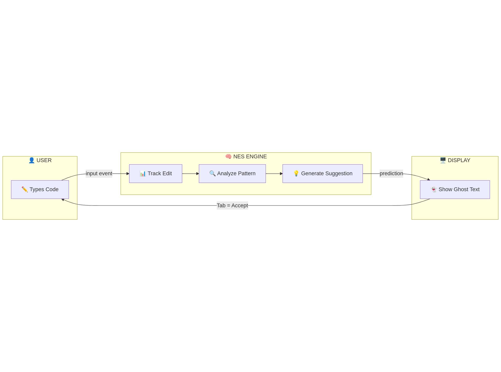


---

## Step 1: Basic Text Editor

### 🎯 Goal
Create a simple editor that captures user input.

### 🧠 Key Concept: The Input Event
When a user types ANYTHING in a textarea, the browser fires an `input` event. We listen for this event to know when the user made a change.

### 📊 Diagram

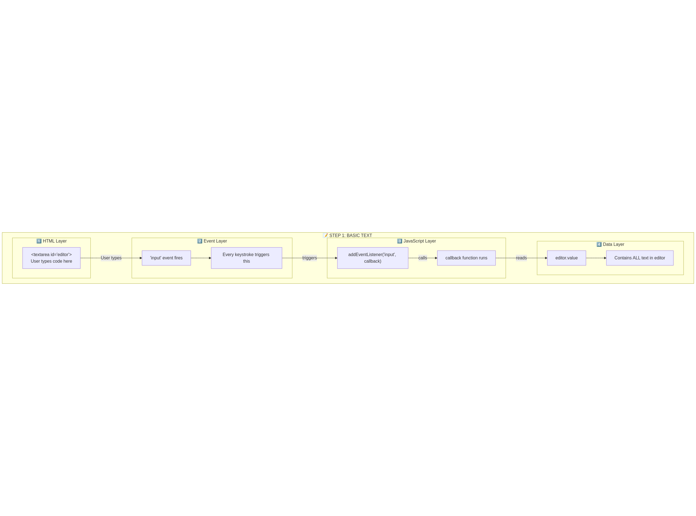


### 💻 Code Example

```javascript
// Step 1: The simplest editor - just a textarea
const editor = document.getElementById('editor');

// Listen for any changes
editor.addEventListener('input', function() {
    console.log('User typed something!');
    console.log('Current text:', editor.value);
});
```

### ✅ What You Learn
- The `input` event is your "hook" into user actions
- `editor.value` gives you ALL the text currently in the editor
- This fires on EVERY keystroke (typing, deleting, pasting)

---

## Step 2: Track What Changed

### 🎯 Goal
Know exactly WHAT the user changed, not just THAT something changed.

### 🧠 Key Concept: Diffing
We keep a copy of the "previous" text. When user types, we compare "previous" with "current". The difference tells us what kind of edit happened.

### 📊 Diagram
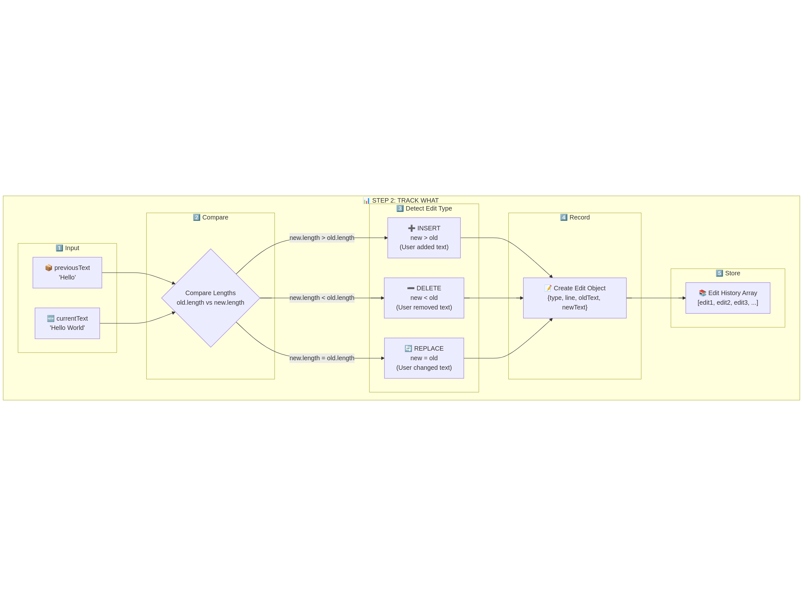


### 💻 Code Example

```javascript
let previousText = '';  // Remember the old text

editor.addEventListener('input', function() {
    const currentText = editor.value;
    
    // Find what changed
    if (currentText.length > previousText.length) {
        console.log('INSERT - User added text');
    } else if (currentText.length < previousText.length) {
        console.log('DELETE - User removed text');
    } else {
        console.log('REPLACE - User changed text');
    }
    
    // Update previous for next comparison
    previousText = currentText;
});
```

### ✅ Three Types of Edits

| Type | Condition | Example |
|------|-----------|---------|
| **INSERT** | new > old | Added " World" to "Hello" |
| **DELETE** | new < old | Removed text |
| **REPLACE** | new = old | Changed "cat" to "dog" |

---

## Step 2B: Edit Object Structure

### 🎯 Goal
Understand the data structures used to store edits.

### 🧠 Key Concept: Structured Data
Each edit is stored as an object with all the information needed for pattern detection.

### 📊 Diagram
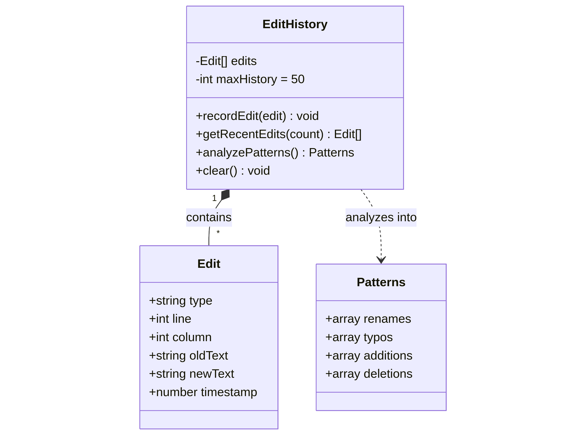


### 💻 Code Example

```javascript
// The Edit Object
const edit = {
    type: 'replace',      // 'insert' | 'delete' | 'replace'
    line: 5,              // Which line changed
    column: 10,           // Which column
    oldText: 'count',     // What was there before
    newText: 'total',     // What's there now
    timestamp: Date.now() // When it happened
};

// The Edit History Class
class EditHistory {
    constructor() {
        this.edits = [];
        this.maxHistory = 50;
    }
    
    recordEdit(edit) {
        this.edits.push(edit);
        if (this.edits.length > this.maxHistory) {
            this.edits.shift();  // Remove oldest
        }
    }
    
    getRecentEdits(count) {
        return this.edits.slice(-count);
    }
}
```

### ✅ Why This Matters
- Structured data is easy to analyze
- History lets us find PATTERNS across multiple edits
- Line/column info tells us WHERE to show suggestions

---

## Step 3: Detect Patterns

### 🎯 Goal
Analyze edit history to find patterns that predict the next edit.

### 🧠 Key Concept: Pattern Recognition
NES looks for common coding patterns that indicate what the user is trying to do.

### 📊 Diagram
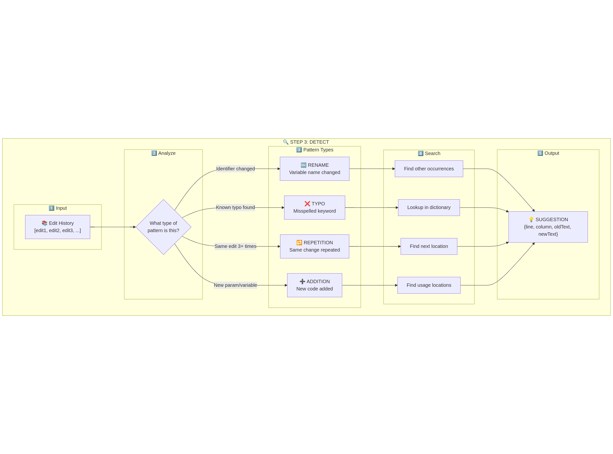


### ✅ Four Pattern Types

| Pattern | What It Detects | Example |
|---------|-----------------|---------|
| **Rename** | Variable name changed | `count` → `total` |
| **Typo** | Misspelled keyword | `conts` → `const` |
| **Repetition** | Same edit done 3+ times | Adding `.trim()` everywhere |
| **Addition** | New code unused | New parameter not used in function |

---

## Step 3B: Typo Detection

### 🎯 Goal
Implement the simplest pattern: detecting typos.

### 🧠 Key Concept: Dictionary Lookup
We have a dictionary of common typos → fixes. We scan the code for any typo in our dictionary.

### 📊 Diagram
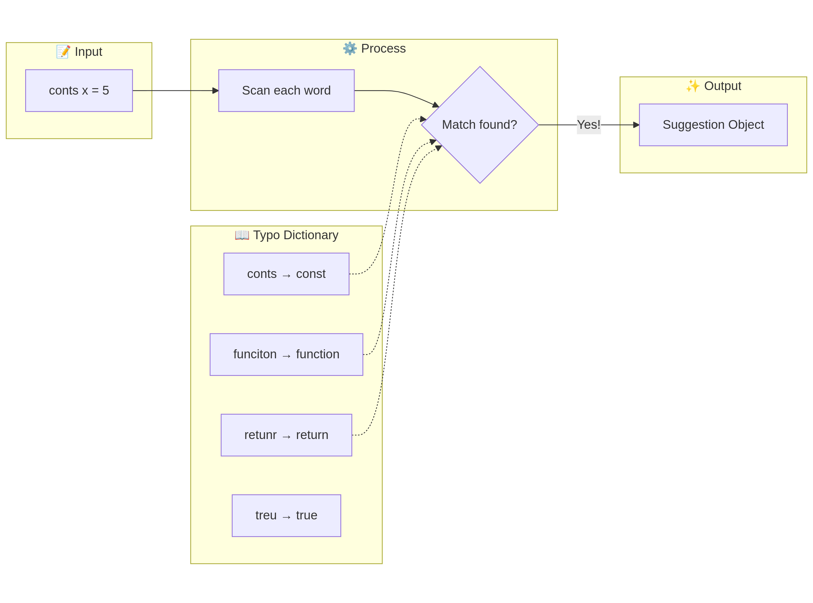


### 💻 Code Example

```javascript
const typos = {
    'conts': 'const',
    'funciton': 'function',
    'retunr': 'return',
    'treu': 'true',
    'flase': 'false',
    'lenght': 'length',
    'undefiend': 'undefined'
};

function findTypo(code) {
    for (const [typo, fix] of Object.entries(typos)) {
        const index = code.indexOf(typo);
        if (index !== -1) {
            // Found a typo!
            const lines = code.substring(0, index).split('\n');
            const line = lines.length - 1;
            const column = lines[lines.length - 1].length;
            
            return {
                type: 'typo',
                line: line,
                column: column,
                oldText: typo,
                newText: fix,
                reason: `Fix typo: "${typo}" → "${fix}"`
            };
        }
    }
    return null;
}
```

### ✅ Why Typos First?
- Easy to implement (great starting point!)
- High confidence (typos are clear mistakes)
- Users appreciate catching their mistakes

---

## Step 3C: Rename Propagation

### 🎯 Goal
When user renames a variable on one line, suggest renaming it everywhere else.

### 🧠 Key Concept: Find and Replace
Detect when a variable name changes, then find all other occurrences of the old name.

### 📊 Diagram
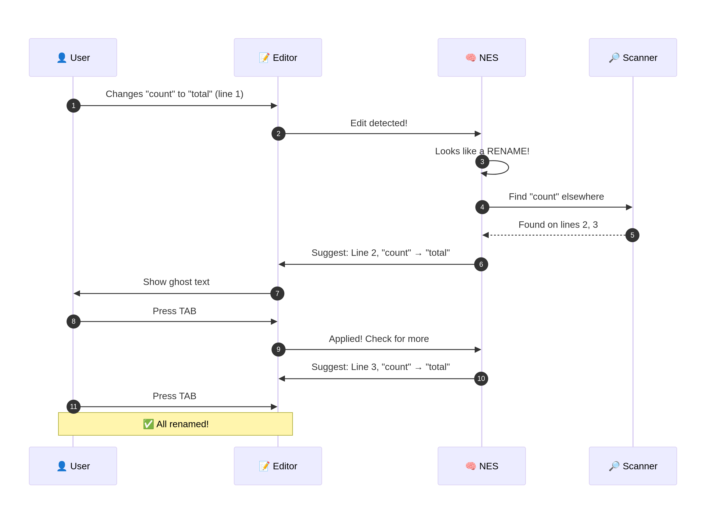

### 💻 Code Example

```javascript
function detectRename(oldLine, newLine) {
    // Extract identifiers (variable names)
    const oldIds = oldLine.match(/\b([a-zA-Z_]\w*)\b/g) || [];
    const newIds = newLine.match(/\b([a-zA-Z_]\w*)\b/g) || [];
    
    // Find what changed
    for (let i = 0; i < oldIds.length; i++) {
        if (oldIds[i] !== newIds[i]) {
            return { from: oldIds[i], to: newIds[i] };
        }
    }
    return null;
}

function findRenameOpportunities(rename, code, skipLine) {
    const lines = code.split('\n');
    const suggestions = [];
    
    lines.forEach((line, index) => {
        if (index !== skipLine && line.includes(rename.from)) {
            suggestions.push({
                line: index,
                column: line.indexOf(rename.from),
                oldText: rename.from,
                newText: rename.to
            });
        }
    });
    
    return suggestions;
}
```

---

## Step 4: Display Ghost Text

### 🎯 Goal
Show the suggestion visually to the user.

### 🧠 Key Concept: Ghost Text
Semi-transparent text that shows what will change. Old text has strikethrough, new text is highlighted.

### 📊 Diagram
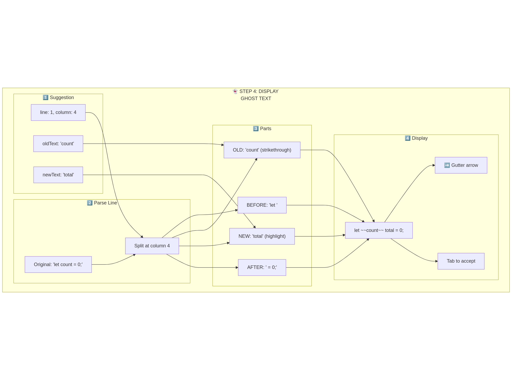


### 💻 Code Example

```javascript
function renderSuggestion(line, suggestion) {
    const before = line.substring(0, suggestion.column);
    const old = suggestion.oldText;
    const newer = suggestion.newText;
    const after = line.substring(suggestion.column + old.length);
    
    return `
        <span class="normal">${before}</span>
        <span class="strikethrough">${old}</span>
        <span class="highlight">${newer}</span>
        <span class="normal">${after}</span>
    `;
}

// CSS
const styles = `
.strikethrough {
    text-decoration: line-through;
    color: #f87171;
    background: rgba(248, 113, 113, 0.2);
}

.highlight {
    color: #4ade80;
    background: rgba(74, 222, 128, 0.2);
    border: 1px dashed #4ade80;
}
`;
```

---

## Step 4B: Keyboard Handling

### 🎯 Goal
Handle Tab, Escape, and normal typing.

### 🧠 Key Concept: Tab-Tab-Tab Workflow
- **Tab** (at suggestion line) → Accept
- **Tab** (different line) → Navigate to suggestion
- **Escape** → Dismiss
- **Other keys** → Continue typing

### 📊 Diagram
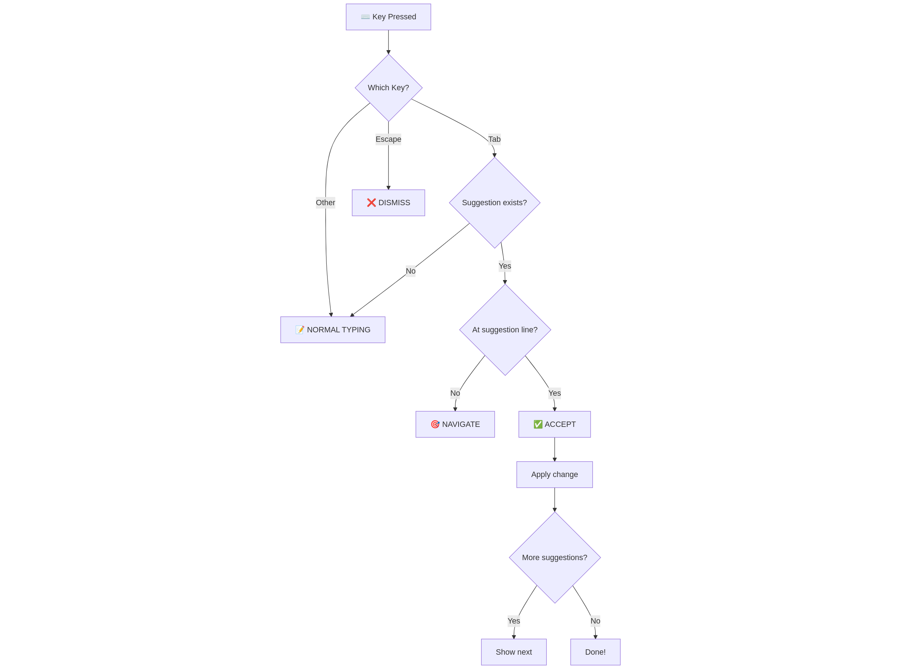


### 💻 Code Example

```javascript
editor.addEventListener('keydown', function(e) {
    if (e.key === 'Tab' && currentSuggestion) {
        e.preventDefault();  // Don't insert tab character
        
        if (cursorLine === currentSuggestion.line) {
            // Accept the suggestion
            applySuggestion(currentSuggestion);
            checkForMoreSuggestions();
        } else {
            // Navigate to suggestion
            moveCursorToLine(currentSuggestion.line);
        }
    }
    
    if (e.key === 'Escape' && currentSuggestion) {
        // Dismiss suggestion
        currentSuggestion = null;
        hideGhostText();
    }
});
```

---

## Step 5: State Machine

### 🎯 Goal
Understand all possible states of NES and transitions between them.

### 🧠 Key Concept: Finite State Machine
NES can be in one of five states at any time. Each state has specific behavior.

### 📊 Diagram
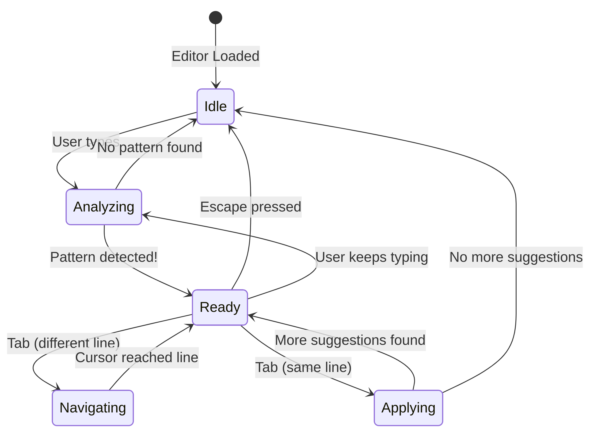


### ✅ The Five States

| State | Description | What's Visible |
|-------|-------------|----------------|
| **Idle** | Waiting for input | Nothing |
| **Analyzing** | Processing edit | Loading indicator |
| **Ready** | Suggestion available | Ghost text + arrow |
| **Navigating** | Moving cursor | Cursor animation |
| **Applying** | Changing code | Code update |

---

## Step 6: Complete Data Flow

### 🎯 Goal
See how data flows through all layers of NES.

### 📊 Diagram
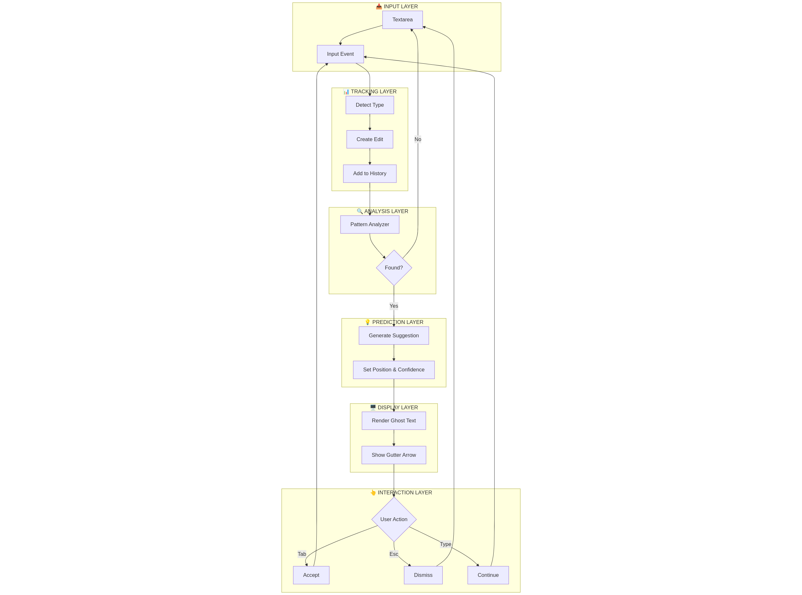


### ✅ The Six Layers

| # | Layer | Responsibility |
|---|-------|----------------|
| 1 | Input | Capture user typing |
| 2 | Tracking | Detect and store edits |
| 3 | Analysis | Find patterns |
| 4 | Prediction | Generate suggestions |
| 5 | Display | Show ghost text |
| 6 | Interaction | Handle keyboard |

---

## Step 7: AI Integration

### 🎯 Goal
Enhance NES with AI for smarter predictions.

### 🧠 Key Concept: LLM-Powered Predictions
Simple patterns (typos, renames) work with rules. Complex patterns need AI to understand intent.

### 📊 Diagram
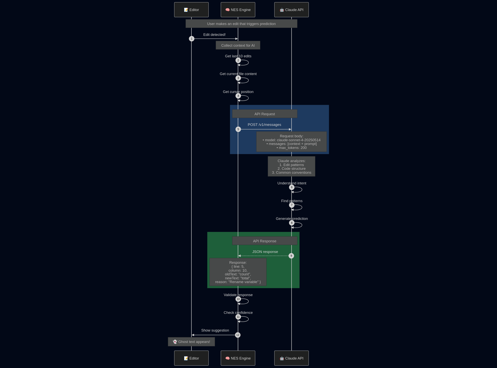


### 💻 Code Example

```javascript
async function getAIPrediction(editHistory, code, cursor) {
    const response = await fetch('https://api.anthropic.com/v1/messages', {
        method: 'POST',
        headers: {
            'Content-Type': 'application/json',
            'x-api-key': API_KEY,
            'anthropic-version': '2023-06-01'
        },
        body: JSON.stringify({
            model: 'claude-sonnet-4-20250514',
            max_tokens: 200,
            messages: [{
                role: 'user',
                content: `
                    Recent edits: ${JSON.stringify(editHistory)}
                    Current code: ${code}
                    Cursor: line ${cursor.line}, column ${cursor.column}
                    
                    Predict the next edit as JSON:
                    { line, column, oldText, newText, reason }
                `
            }]
        })
    });
    
    const data = await response.json();
    return JSON.parse(data.content[0].text);
}
```

### ✅ Why AI?

| Pattern Type | Rule-Based | AI-Powered |
|--------------|------------|------------|
| Typos | ✅ Easy | Overkill |
| Renames | ✅ Medium | Better |
| Refactoring | ❌ Hard | ✅ Great |
| Intent Detection | ❌ Impossible | ✅ Excellent |

---

## Final Summary

### 📊 Complete Architecture


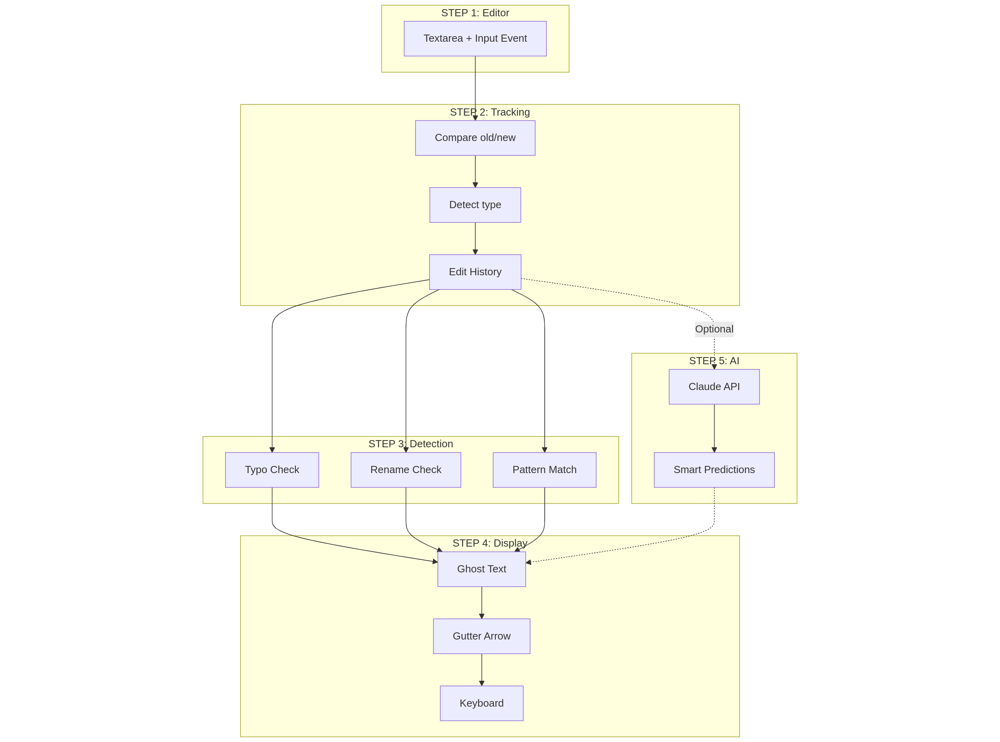


### ✅ Build Order (Recommended)

1. **Basic Editor** - Just capture input
2. **Track Changes** - Know what changed
3. **Detect Typos** - Easiest pattern
4. **Show Ghost Text** - Visual feedback
5. **Keyboard Handling** - Tab/Escape
6. **Detect Renames** - More complex pattern
7. **Add AI** - For complex patterns

---

## Quick Reference

### Key Concepts

| Concept | Description |
|---------|-------------|
| **Input Event** | Fires on every keystroke |
| **Diffing** | Comparing old vs new text |
| **Edit Object** | `{type, line, column, oldText, newText}` |
| **Pattern** | Recognizable edit behavior |
| **Ghost Text** | Semi-transparent suggestion |
| **State Machine** | Idle → Analyzing → Ready → Applying |

### Keyboard Shortcuts

| Key | Action |
|-----|--------|
| **Tab** (at line) | Accept suggestion |
| **Tab** (away) | Navigate to suggestion |
| **Escape** | Dismiss suggestion |

### Pattern Types

| Pattern | Detection Method | Confidence |
|---------|------------------|------------|
| Typo | Dictionary lookup | 95%+ |
| Rename | Identifier changed | 90%+ |
| Repetition | Same edit 3+ times | 80%+ |
| Addition | New code unused | 70%+ |

---

## 🚀 Ready to Build?

Start with Step 1 and work your way through. Each step builds on the previous one!

```javascript
// Your first line of code:
const editor = document.getElementById('editor');
editor.addEventListener('input', () => console.log('NES journey begins!'));
```

**Happy coding!** 🎉

---

*Made with 💜 for developers who want to understand how AI-powered code editors work.*