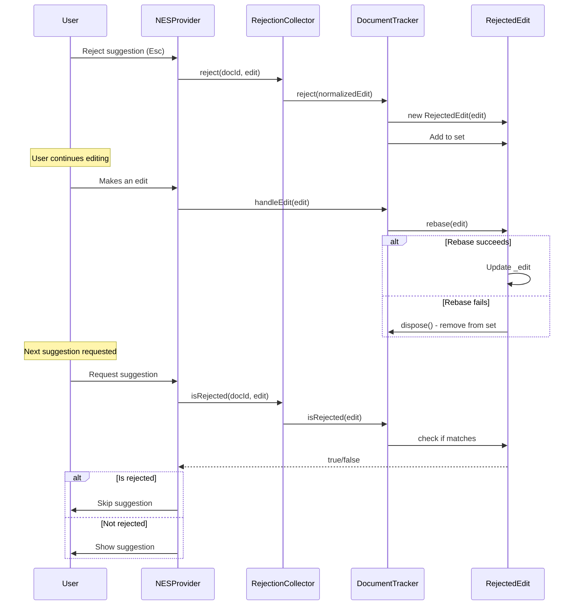

# Product Requirements Document: NES RejectionCollector

**Status**: Draft
**Owner**: NES Team
**Created**: 2025-12-18
**Reference**: `vscode-copilot-chat/src/extension/inlineEdits/common/rejectionCollector.ts`

---

## Executive Summary

The RejectionCollector is a critical component of the Next Edit Suggestions (NES) system that prevents users from seeing the same rejected inline edit suggestions repeatedly. By tracking and maintaining rejected edits across document changes, it significantly improves user experience and reduces frustration.

### Problem Statement

Currently, when users reject an inline edit suggestion by pressing `Esc` or ignoring it, the system has no memory of this rejection. This leads to:

1. **Repeated Annoyance**: Same suggestion appears multiple times in similar contexts
2. **Lost Productivity**: Users waste time rejecting identical suggestions
3. **Poor Learning**: System doesn't adapt to user preferences
4. **Wasted API Calls**: Fetching suggestions that will be rejected again

**Example Scenario**:
```
Line 10: User types "const x = 1"
         Suggestion: "Add type annotation: const x: number = 1"
         User rejects (Esc)

Line 12: User types "const y = 2"
         Suggestion: "Add type annotation: const y: number = 2"  (SAME PATTERN!)
         User rejects again (Frustrated!)

Line 15: User types "const z = 3"
         Suggestion: "Add type annotation: const z: number = 3"  (AGAIN!)
         User gives up on NES entirely
```

---

## Goals

### Primary Goals

1. **Prevent Repeated Rejections**: Never show the same rejected edit pattern twice
2. **Maintain Across Edits**: Track rejections even as document changes
3. **Efficient Memory Usage**: LRU eviction to prevent unbounded memory growth
4. **Accurate Matching**: Use edit normalization to catch variations of same edit

### Success Metrics

| Metric | Target | Measurement |
|--------|--------|-------------|
| Rejection Re-show Rate | <5% | % of rejected edits shown again |
| Memory Usage | <2MB | Total memory for all tracked rejections |
| Match Accuracy | >95% | % of rejected patterns correctly identified |
| User Satisfaction | +30% | Survey: "NES respects my preferences" |

---

## User Stories

### US-1: Prevent Same Rejection
**As a** developer using NES
**I want** rejected suggestions to never appear again
**So that** I don't waste time rejecting the same thing repeatedly

**Acceptance Criteria**:
- When I reject a suggestion with Esc, it is tracked
- The exact same suggestion never appears again in that document
- Similar suggestions (with slight variations) are also prevented

### US-2: Handle Document Changes
**As a** developer actively editing code
**I want** rejection tracking to work even as I edit the document
**So that** my rejection preferences persist across my coding session

**Acceptance Criteria**:
- Rejected edits are rebased when I make other edits
- Rejection tracking survives document reformatting
- Tracking is cleared when document is closed

### US-3: Memory Efficiency
**As a** developer with many open files
**I want** rejection tracking to not consume excessive memory
**So that** my editor remains responsive

**Acceptance Criteria**:
- Old rejections are automatically evicted (LRU)
- Maximum 20 documents tracked simultaneously
- Per-document rejection limit is reasonable

---

## Functional Requirements

### FR-1: Rejection Tracking

**Description**: Track rejected edits per document with normalization

**Requirements**:
1. Store rejected edits as normalized `StringEdit` objects
2. Remove common prefix/suffix before storing
3. Support per-document rejection sets
4. Provide `reject(docId, edit)` API

**Reference**:
```typescript
// vscode-copilot-chat: rejectionCollector.ts:48-57
public reject(docId: DocumentId, edit: StringReplacement): void {
    const docCache = this._documentCaches.get(docId);
    if (!docCache) return;
    const e = edit.removeCommonSuffixAndPrefix(docCache.doc.value.get().value);
    this._tracer.trace(`Rejecting: ${e}`);
    docCache.reject(e);
}
```

### FR-2: Rejection Checking

**Description**: Check if an edit matches a previously rejected pattern

**Requirements**:
1. Normalize input edit before comparison
2. Check against all tracked rejections for document
3. Return boolean indicating rejection status
4. Provide `isRejected(docId, edit)` API

**Reference**:
```typescript
// vscode-copilot-chat: rejectionCollector.ts:59-69
public isRejected(docId: DocumentId, edit: StringReplacement): boolean {
    const docCache = this._documentCaches.get(docId);
    if (!docCache) return false;
    const e = edit.removeCommonSuffixAndPrefix(docCache.doc.value.get().value);
    const isRejected = docCache.isRejected(e);
    return isRejected;
}
```

### FR-3: Edit Rebasing

**Description**: Update rejected edits when document changes

**Requirements**:
1. Listen to document edit events
2. Rebase each rejected edit using `tryRebase()`
3. Remove rejections that can't be rebased
4. Maintain rejection validity across edits

**Reference**:
```typescript
// vscode-copilot-chat: rejectionCollector.ts:86-90
public handleEdit(edit: StringEdit, currentContent: StringText): void {
    for (const r of [...this._rejectedEdits]) {
        r.handleEdit(edit, currentContent); // can remove if rebase fails
    }
}
```

### FR-4: LRU Garbage Collection

**Description**: Automatically evict old rejections to prevent memory growth

**Requirements**:
1. Implement LRU eviction with 20-document limit
2. Evict oldest document when limit exceeded
3. Dispose rejected edits when evicted
4. Provide manual `clear()` method

**Reference**:
```typescript
// vscode-copilot-chat: rejectionCollector.ts:139-164
class LRUGarbageCollector implements IDisposable {
    private _disposables: IDisposable[] = [];

    constructor(private _maxSize: number) {}

    put(disposable: IDisposable): void {
        this._disposables.push(disposable);
        if (this._disposables.length > this._maxSize) {
            this._disposables.shift()!.dispose();
        }
    }
}
```

---

## Non-Functional Requirements

### NFR-1: Performance

| Operation | Target | Constraint |
|-----------|--------|------------|
| `reject()` | <5ms | Must not block UI |
| `isRejected()` | <5ms | Called on every suggestion |
| Memory per document | <100KB | 20 documents max |
| Rebase per edit | <10ms | Per rejected edit |

### NFR-2: Reliability

- **Data Persistence**: Rejections persist for document lifetime
- **Thread Safety**: N/A (single-threaded JS)
- **Error Handling**: Failed rebasing removes rejection (fail-safe)

### NFR-3: Maintainability

- **Code Coverage**: >80% unit test coverage
- **Architecture**: Match reference implementation structure
- **Documentation**: Inline comments + architecture doc

---

## Technical Architecture

### Component Structure

```
RejectionCollector (main facade)
├── _documentCaches: Map<DocumentId, DocumentRejectionTracker>
├── _garbageCollector: LRUGarbageCollector
└── _tracer: ITracer

DocumentRejectionTracker (per-document tracking)
├── _rejectedEdits: Set<RejectedEdit>
└── doc: IObservableDocument (for current content)

RejectedEdit (individual rejection)
├── _edit: StringEdit (normalized)
└── _onDispose: () => void (cleanup callback)

LRUGarbageCollector (memory management)
└── _disposables: IDisposable[] (LRU queue)
```

### Data Flow



---

## Integration Points

### 1. PukuNesNextEditProvider Integration

**Location**: `src/chat/src/extension/pukuai/vscode-node/providers/pukuNesNextEditProvider.ts`

**Changes Required**:
```typescript
// Constructor: Initialize RejectionCollector
this._rejectionCollector = this._register(
    new RejectionCollector(this.workspace, (s) => this._logService.trace(s))
);

// getNextEdit: Check before showing
const isRejected = this._rejectionCollector.isRejected(docId, edit);
if (isRejected) {
    this._logService.trace('[NES] Edit was previously rejected, skipping');
    return null;
}

// handleRejection: Track rejection
this._rejectionCollector.reject(
    DocumentId.create(docId.document.uri.toString()),
    result.edit
);
```

### 2. ObservableWorkspace Dependency

**Required**: RejectionCollector needs `ObservableWorkspace` for:
- Document lifecycle tracking (open/close)
- Document content observation
- Edit event handling

**Note**: If `ObservableWorkspace` is not yet available, we need to implement it first or create a simplified version.

---

## Implementation Plan

### Phase 1: Core Classes (Day 1)

**Files to Create**:
1. `src/chat/src/extension/pukuai/common/rejectionCollector.ts` (~180 lines)

**Classes**:
- `RejectionCollector` - Main facade
- `DocumentRejectionTracker` - Per-document tracking
- `RejectedEdit` - Individual rejection with rebasing
- `LRUGarbageCollector` - Memory management

**Deliverables**:
- ✅ All four classes implemented
- ✅ Compiles without errors
- ✅ Matches reference structure

### Phase 2: Integration (Day 2)

**Files to Modify**:
1. `src/chat/src/extension/pukuai/vscode-node/providers/pukuNesNextEditProvider.ts`
   - Add `_rejectionCollector` field
   - Initialize in constructor
   - Check in `getNextEdit()`
   - Track in `handleRejection()`

2. `src/chat/src/extension/pukuai/node/nextEditCache.ts`
   - **Remove** `rejectEdit()` method
   - **Remove** `rejected` field from `CachedEdit`
   - Delegate to RejectionCollector instead

**Deliverables**:
- ✅ RejectionCollector integrated
- ✅ Basic rejection tracking removed from NextEditCache
- ✅ All tests pass

### Phase 3: Testing (Day 3)

**Test Files to Create**:
1. `src/chat/src/extension/pukuai/test/rejectionCollector.spec.ts` (~200 lines)

**Test Cases**:
- ✅ Track rejected edit
- ✅ Identify rejected edit on re-check
- ✅ Don't flag non-rejected edits
- ✅ Rebase rejections on document edit
- ✅ Remove rejections that fail rebasing
- ✅ LRU eviction works correctly
- ✅ Clear all rejections

**Deliverables**:
- ✅ All unit tests pass
- ✅ >80% code coverage
- ✅ Manual testing confirms UX improvement

---

## Dependencies

### Required Before Implementation

1. **ObservableWorkspace** (BLOCKER)
   - Status: Needs investigation
   - Alternative: Create simplified version
   - Decision: TBD

2. **StringEdit.tryRebase()** (REQUIRED)
   - Status: Need to verify availability
   - Location: `util/vs/editor/common/core/edits/stringEdit.ts`
   - Fallback: Implement if missing

### Used By This Feature

- DocumentId
- StringReplacement
- StringEdit
- StringText
- ILogService

---

## Risks & Mitigations

| Risk | Impact | Probability | Mitigation |
|------|--------|-------------|------------|
| ObservableWorkspace not available | High | Medium | Create simplified version or defer |
| Edit rebasing too complex | Medium | Low | Use simpler equality check initially |
| Memory leaks from unbounded tracking | High | Low | LRU eviction + testing |
| False positives (over-rejecting) | Medium | Medium | Careful normalization + tuning |

---

## Open Questions

1. **Q**: Do we have ObservableWorkspace available?
   - **A**: TBD - need to check codebase
   - **Owner**: Implementation team
   - **Due**: Before Phase 1

2. **Q**: Should we integrate with NextEditCache's rejection tracking?
   - **A**: No - separate concerns, remove from NextEditCache
   - **Owner**: Architecture team
   - **Due**: Phase 2

3. **Q**: What happens to rejections when document is renamed?
   - **A**: Follow reference - track by DocumentId (URI-based)
   - **Owner**: Implementation team
   - **Due**: Phase 1

---

## Success Criteria

### Launch Criteria

- ✅ All unit tests pass (>80% coverage)
- ✅ Manual testing shows no repeated rejections
- ✅ Memory usage <2MB for typical workload
- ✅ No performance regression in `getNextEdit()`
- ✅ Documentation complete (this PRD + architecture doc)

### Post-Launch Metrics (2 weeks)

- Rejection re-show rate <5%
- No memory leak reports
- User satisfaction survey +30%
- Zero P0 bugs

---

## References

- Reference Implementation: `src/vscode/reference/vscode-copilot-chat/src/extension/inlineEdits/common/rejectionCollector.ts`
- Related: NextEditCache (Issue #129)
- Related: NES Debouncing Architecture (`docs/architecture/nes-debouncing-architecture.md`)

---

## Appendix A: API Reference

```typescript
/**
 * RejectionCollector - Tracks rejected inline edit suggestions
 *
 * Prevents users from seeing the same rejected suggestion repeatedly by:
 * 1. Normalizing edits (removing common prefix/suffix)
 * 2. Tracking rejections per document
 * 3. Rebasing rejections when document changes
 * 4. LRU eviction to prevent memory growth
 */
export class RejectionCollector extends Disposable {
    constructor(
        workspace: ObservableWorkspace,
        trace: (s: string) => void
    );

    /**
     * Mark an edit as rejected
     * @param docId Document identifier
     * @param edit The rejected edit
     */
    reject(docId: DocumentId, edit: StringReplacement): void;

    /**
     * Check if an edit was previously rejected
     * @param docId Document identifier
     * @param edit The edit to check
     * @returns true if edit was rejected before
     */
    isRejected(docId: DocumentId, edit: StringReplacement): boolean;

    /**
     * Clear all rejection tracking
     */
    clear(): void;
}
```

---

## Appendix B: Example Usage

```typescript
// Initialize
const rejectionCollector = new RejectionCollector(
    workspace,
    (msg) => logService.trace(msg)
);

// When user rejects suggestion
rejectionCollector.reject(docId, edit);

// Before showing suggestion
if (rejectionCollector.isRejected(docId, edit)) {
    return null; // Skip this suggestion
}

// Clean up
rejectionCollector.dispose();
```
