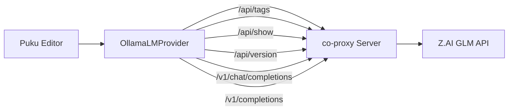

# Using GLM Models with Puku Editor

This guide explains how to use Z.AI's GLM models (GLM-4.6, GLM-4.5, GLM-4.5-Air) with Puku Editor through the Ollama-compatible proxy.

## Prerequisites

1. **Z.AI API Key** - Get your API key from Z.AI
2. **Proxy Server** - The `co-proxy` server running on `localhost:11434`
3. **Puku Editor** - This VS Code extension (built on GitHub Copilot Chat architecture)

## Quick Start

### 1. Start the Proxy Server

The proxy server bridges GitHub Copilot Chat with Z.AI's GLM models:

```bash
cd /path/to/github/co-proxy
export ZAI_API_KEY="your-zai-api-key"
uv run copilot-proxy --host 127.0.0.1 --port 11434
```

The proxy will start on `http://localhost:11434` and expose:
- Ollama-compatible API endpoints for model discovery
- OpenAI-compatible endpoints for chat and completions

### 2. Build and Install This Extension

```bash
cd /path/to/github/puku-editor
npm install
npm run compile
```

Then press `F5` to launch the extension in debug mode, or package it:

```bash
npm run package
code --install-extension copilot-chat-*.vsix
```

### 3. Configure VS Code

Add to your VS Code settings (`.vscode/settings.json` or User Settings):

```json
{
  "github.copilot.chat.byok.ollamaEndpoint": "http://localhost:11434"
}
```

### 4. Select GLM Model in Puku Editor

1. Open the Chat panel (`Ctrl+Alt+I` or `Cmd+Opt+I`)
2. Click on the current model name at the top
3. Click **"Manage Models..."**
4. Select **"Ollama"** from the list of providers
5. Choose your preferred GLM model:
   - **GLM-4.6** - Flagship model with tool calling and vision support
   - **GLM-4.5** - Balanced performance for everyday coding
   - **GLM-4.5-Air** - Lightweight, faster response variant

## Features

### Chat Completions

The proxy fully supports chat-based interactions through the Copilot Chat panel:

- ✅ Multi-turn conversations with context
- ✅ Streaming responses
- ✅ Tool calling support (with GLM-4.6)
- ✅ Vision support (with GLM-4.6)
- ✅ Long context windows (32K tokens)

### Inline Code Completions (FIM)

The proxy converts GitHub Copilot's Fill-In-Middle (FIM) completion requests to chat format:

- ✅ Ghost text suggestions as you type
- ✅ Context-aware completions
- ✅ Multi-line completions
- ✅ Code before and after cursor (suffix support)

**How FIM works:**

1. Copilot sends completion request to `/v1/completions` with:
   - `prompt`: Code before cursor
   - `suffix`: Code after cursor (optional)
   - `max_tokens`: Maximum completion length
   - `temperature`: Sampling temperature

2. Proxy converts to chat format:
   - **Without suffix**: "Complete this code: {prompt}"
   - **With suffix**: "Complete between <CODE_BEFORE>{prompt}</CODE_BEFORE> and <CODE_AFTER>{suffix}</CODE_AFTER>"

3. GLM model generates completion

4. Proxy converts response back to completion format and streams to VS Code

## Architecture



### Key Components

**Puku Editor:**
- `src/extension/byok/vscode-node/ollamaProvider.ts` - Ollama provider implementation
- `src/extension/byok/vscode-node/baseOpenAICompatibleProvider.ts` - Base OpenAI-compatible provider
- `src/extension/completions/vscode-node/completionsProvider.ts` - Inline completions provider

**co-proxy Server:**
- `copilot_proxy/app.py` - FastAPI application
- Implements Ollama API (`/api/*`) and OpenAI API (`/v1/*`)
- Converts between formats and forwards to Z.AI

**Endpoints:**

| Endpoint | Purpose | Used By |
|----------|---------|---------|
| `GET /api/version` | Version check (returns 0.6.4) | OllamaLMProvider initialization |
| `GET /api/tags` | List available models | Model picker UI |
| `POST /api/show` | Get model details | Model info display |
| `POST /v1/chat/completions` | Chat messages | Chat panel conversations |
| `POST /v1/completions` | Code completions | Inline ghost text suggestions |

## Troubleshooting

### Models not appearing

**Problem:** Ollama provider shows no models

**Solution:**
1. Verify proxy is running: `curl http://localhost:11434/api/version`
2. Check endpoint setting: `"github.copilot.chat.byok.ollamaEndpoint": "http://localhost:11434"`
3. Restart VS Code
4. Check proxy logs for errors

### Chat not working

**Problem:** Chat messages fail or timeout

**Solution:**
1. Verify Z.AI API key is set: `echo $ZAI_API_KEY`
2. Test directly: `curl -X POST http://localhost:11434/v1/chat/completions -H "Content-Type: application/json" -d '{"model":"GLM-4.6","messages":[{"role":"user","content":"Hello"}]}'`
3. Check proxy logs for 401 Unauthorized errors
4. Ensure API key has access to GLM models

### Inline completions not working

**Problem:** No ghost text suggestions appear

**Solution:**
1. Test FIM endpoint: `curl -X POST http://localhost:11434/v1/completions -H "Content-Type: application/json" -d '{"prompt":"def hello():","suffix":"","stream":false}'`
2. Check if completions are enabled in VS Code settings
3. Verify model supports completions (all GLM models do)
4. Check proxy logs for completion requests

### Proxy connection errors

**Problem:** "Failed to fetch models from Ollama"

**Solution:**
1. Ensure proxy is running on correct port (11434)
2. Check for port conflicts: `lsof -i :11434` (macOS/Linux) or `netstat -ano | findstr :11434` (Windows)
3. Verify endpoint URL has correct protocol: `http://` not `https://`
4. Check firewall settings

## Advanced Configuration

### Custom Endpoint Port

If you need to run the proxy on a different port:

```bash
# Start proxy on custom port
uv run copilot-proxy --host 127.0.0.1 --port 8080
```

Update VS Code settings:

```json
{
  "github.copilot.chat.byok.ollamaEndpoint": "http://localhost:8080"
}
```

### Custom Z.AI Base URL

If using a different Z.AI endpoint:

```bash
export ZAI_API_BASE_URL="https://custom.zai.endpoint.com"
export ZAI_API_KEY="your-key"
uv run copilot-proxy
```

### Multiple Model Configurations

You can switch between different model providers easily:

```json
{
  "github.copilot.chat.byok.ollamaEndpoint": "http://localhost:11434",  // GLM models
  "github.copilot.advanced.debug.testOverrideProxyUrl": "http://localhost:8080"  // Alternative
}
```

## Testing

### Test Chat Endpoint

```bash
curl -X POST http://localhost:11434/v1/chat/completions \
  -H "Content-Type: application/json" \
  -d '{
    "model": "GLM-4.6",
    "messages": [
      {"role": "user", "content": "Write a hello world function in Python"}
    ],
    "stream": false
  }'
```

### Test Completions Endpoint

```bash
# Simple completion
curl -X POST http://localhost:11434/v1/completions \
  -H "Content-Type: application/json" \
  -d '{
    "prompt": "def fibonacci(n):",
    "suffix": "",
    "max_tokens": 200,
    "stream": false
  }'

# FIM with suffix
curl -X POST http://localhost:11434/v1/completions \
  -H "Content-Type: application/json" \
  -d '{
    "prompt": "def fibonacci(n):",
    "suffix": "\n    return result",
    "max_tokens": 200,
    "stream": false
  }'
```

### Test Model Discovery

```bash
# List models
curl http://localhost:11434/api/tags

# Get model info
curl -X POST http://localhost:11434/api/show \
  -H "Content-Type: application/json" \
  -d '{"model": "GLM-4.6"}'
```

## Development

### Debugging Puku Editor

1. Open Puku Editor project in VS Code
2. Press `F5` to launch Extension Development Host
3. Set breakpoints in:
   - `src/extension/byok/vscode-node/ollamaProvider.ts` - Model discovery
   - `src/extension/conversation/vscode-node/chatParticipants.ts` - Chat handling
   - `src/extension/completions/vscode-node/completionsProvider.ts` - Inline completions

4. Open Developer Tools in Extension Development Host: `Help > Toggle Developer Tools`
5. Check console for errors and network requests

### Debugging the Proxy

The proxy includes debug logging. Check logs for:

```
INFO:     127.0.0.1:xxxxx - "POST /v1/chat/completions HTTP/1.1" 200 OK
INFO:     127.0.0.1:xxxxx - "POST /v1/completions HTTP/1.1" 200 OK
DEBUG: Chat response: {"id": "...", "choices": [...]}
```

### Adding Custom Prompts

To modify FIM prompts, edit `copilot_proxy/app.py`:

```python
# Around line 184-196
if suffix:
    user_prompt = f"Your custom FIM prompt with {prompt} and {suffix}"
else:
    user_prompt = f"Your custom completion prompt with {prompt}"
```

## Resources

- [Z.AI API Documentation](https://api.z.ai/docs)
- [Ollama API Specification](https://github.com/ollama/ollama/blob/main/docs/api.md)
- [OpenAI API Reference](https://platform.openai.com/docs/api-reference)
- [GitHub Copilot Chat Extension](https://marketplace.visualstudio.com/items?itemName=GitHub.copilot-chat)

## License

This setup integrates multiple components:
- Puku Editor (based on GitHub Copilot Chat architecture): MIT License
- co-proxy: MIT License
- Z.AI GLM Models: Subject to Z.AI terms of service
